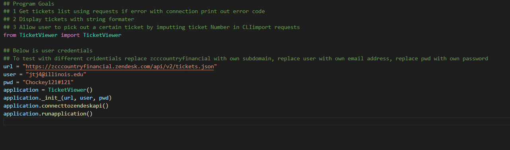
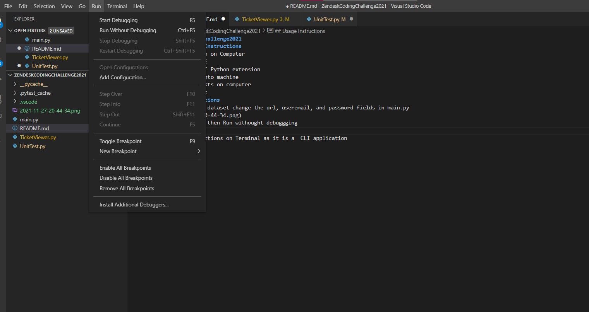

# ZendeskCodingChallenge2021
## Installation Instructions
1. Install Python on Computer
2. Install VSCODE
3. Install VSCODE Python extension
4. Install PIP onto machine
5. Install requests on computer 
6. Install Pytest
## Usage Instructions
1. To change the dataset change the url, useremail, and password fields in main.py

2.  Click onto main.py editor, Click Run and then Run withought debuggging 

3. Follow Instructions on Terminal as it is a  CLI application

